# 第一课 TON\&Tact生态介绍

## 1 TON生态

*   Telegram于 2018 年创建了 Telegram Open Network
*   ICO 获得 17 亿美元的代币销售
*   SEC 命令 Telegram 停止销售之前与 TON 区块链相关的代币 \$GRAM
*   2020 年 5 月，Telegram宣布终止参与区块链的开发，并开始向早期投资者发放退款
*   在 Telegram 放弃 TON 项目后，一群社区开发人员将其重新命名为 The Open Network
*   Telegram App整合自托管钱包“Ton Space”，支持TON钱包
*   2023年 9 月，Telegram 已认定选择 TON 网络作为其 Web3 基础设施的区块链网络，TON 生态的多个项目和进展都将基于 Telegram 进行构建
*   TON 背靠 Telegram 的 8 亿多用户支持，有着类似微信的发展前景
*   <https://ton.app> 这个是ton的app中心，上面都是ton生态上的一些项目，目前大概有500多个

## 2 Tact语言

> TON 生态系统主要使用两种智能合约编程语言：FunC 和 Tact。

*   FunC是一种低级语言，类似C语言的语法格式，比较偏底层，专为深入了解TON架构的开发人员而设计，它在开发复杂的多合约系统时可能具有挑战性。
*   Tact是TON区块链的一种新编程语言，注重效率和简单性。它的设计易于学习和使用，并且非常适合智能合约。Tact是一种静态类型语言，具有简单的语法和强大的类型系统。
*   Tact提供了受JavaScript和Typescript、Rust和Swift启发的熟悉语法。对于新开发人员来说，代数数据类型和编译时执行等强大功能看起来有机且友好。
*   编译器会把Tact代码转译为FunC代码，最终编译为类似Fift的字节码，在TON虚拟机TVM上执行。编译的过程是把高级语言Tact编译为低级语言FunC，我们平常主要用Tact语言进行开发，Tact语言层级比较高，开发起来效率高，也比较符合应用层程序员的开发习惯，上手也会更容易一些。
*   TON虽然提供了2种开发语言，但是平时开发的话推荐用Tact来开发，Tact的代码相比于FunC代码来说，具有如下优势：
    *   简洁
    *   更现代化
    *   具有面相对象特性
    *   易封装

## 3 Tact开发环境搭建

* 安装TON钱包
  TON的钱包有很多种，我们这里安装的是tonkeeper钱包，谷歌浏览器提供了tonkeeper插件，我们进入chrome应用商店里搜索tonkeeper完成tonkeeper插件的安装，如下图所示。

  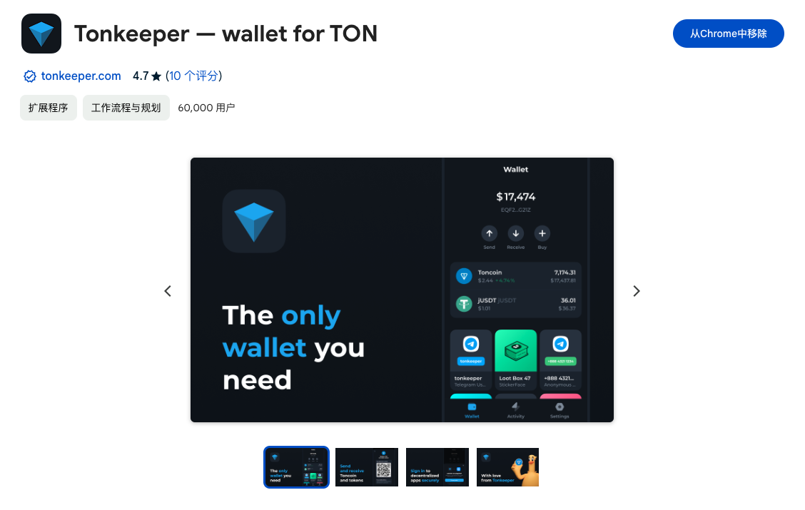

  安装完成后，就会在chrome扩展程序中展示出tonkeeper，这样TON的钱包我们就安装好了。

* 创建区块链账户

  安装完成后我们要创建钱包，如下图所示

  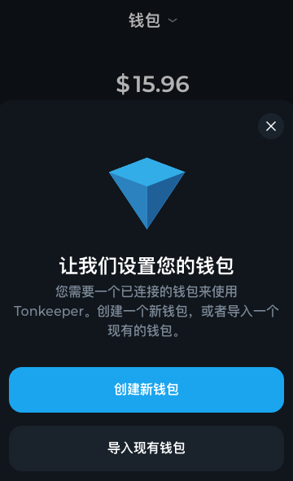

  如果已经有TON钱包了，可以导入现有钱包，如果没有TON钱包，那么就选择创建新钱包。点击创建新钱包，会让你记下恢复短语，如下图所示

  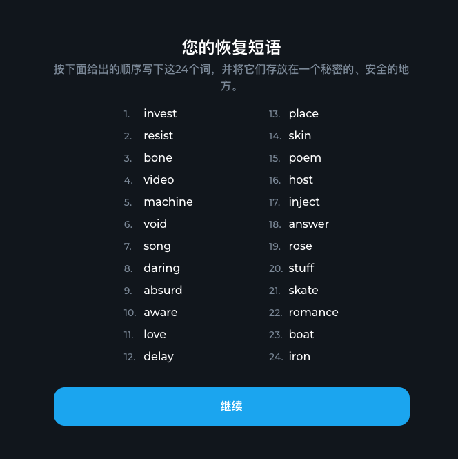

  我们要牢记恢复短语，丢失了恢复短语就丢失了钱包，再也找不回来了。

  接着需要验证恢复短语、输入钱包密码和钱包名称，做完这些步骤，一个TON非托管钱包就创建完成了。创建完成后就可以在tonkeeper插件中看到自己刚刚创建的钱包账户，如下图所示

  

* 配置测试区块链网络

  TON目前有2种网络，一种是正式网，所有的区块链数据都在上面；一种是测试网，开发人员平时用的最多的是测试网。

  我们当前的课程也是在测试网上进行的，下面介绍如何切换正式网和测试网。

  首先打开chrome的钱包，选择"设置"，划到最底部，如下图

  

  连续点击钱包图标6次，会出现选择网络选项，如下图

  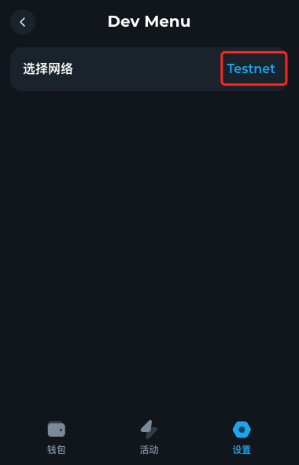

  点击选择网络网络名称，网络会在mainnet和testnet之间切换，当网络名称显示testnet时，表示切换到测试网成功。

* 申领测试币

  当我们在TON区块链上进行开发的时候，比如写数据、读数据等操作是需要从TON钱包进行扣费的，所以我们的TON钱包还需要有测试币。

  下面就介绍下如何在测试网络领取测试币。  
  打开TON的app中心：https://ton.app，进入页面后选择Utilities模块，找到Testnet Faucet应用，如下图

  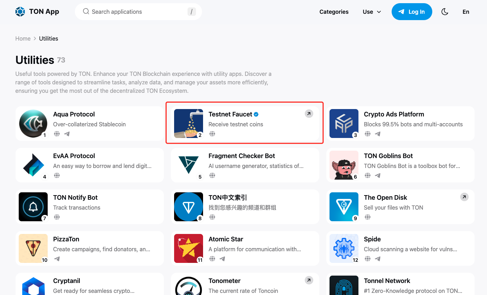

  这个应用就是领取测试网络的测试币的，它是一个BOT，点击后会自动唤起Telegram，如下图

  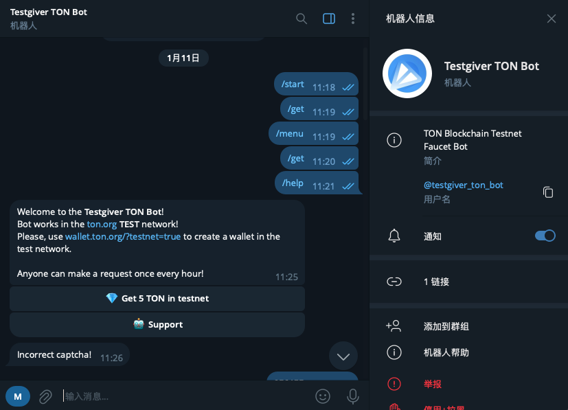

  点击Get 5 TON in testnet按钮，会让你输入钱包地址，输入钱包地址后，会出现一个验证码，输入验证码后，会出现如下提示

  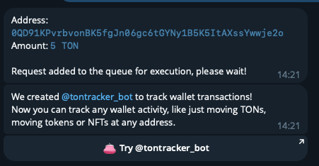

  这表明测试币已经领取成功，稍等一会你在钱包里就可以看到余额变成5。不过领取测试币有一个小时的时间间隔，不可频繁领取。

* 安装Visual Studio Code插件Tact Language Support

  我们推荐使用Visual studio code开发工具，在使用Visual studio code之前我们还需要安装一个插件：Tact Language Support。

  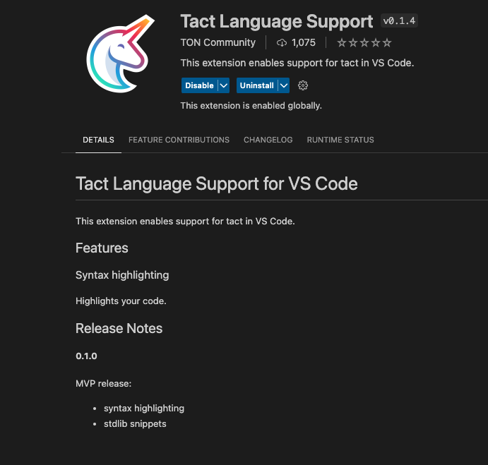

  安装完插件后，Visual Studio Code就能对Tact语法进行高亮显示。

## 4 智能合约示例

*   合约说明

1. 工程模板   
   工程模板github地址：https://github.com/tact-lang/tact-template  
   这个工程是一个官方的模板工程，我们可以将此工程克隆下来，这个工程里有一个示例合约：SampleTactContract，使用Tact语言编写，它包含如下部分：
   * 2个状态：owner和counter，
   * 一个初始化函数：init，用于初始化数据
   * 合约内部的方法：add和subtract
   * 2个消息处理函数：receiver，用户接收和处理消息（注：和智能合约交互的方式就是给合约发消息）  
   * 1个get方法：counter（注：调用者调用时是getCounter方法）
   **代码如下：**
   ```
    import "@stdlib/deploy";
    
    message Add {
      amount: Int as uint32;
    }
    
    contract SampleTactContract with Deployable {
    
      owner: Address;
      counter: Int as uint32;
    
      init(owner: Address) {
          self.owner = owner;
          self.counter = 0;
      }
    
      fun add(v: Int) {
        
          // Check sender
          let ctx: Context = context();
          require(ctx.sender == self.owner, "Invalid sender");
        
          // Update counter
          self.counter = (self.counter + v);
      }
    
      receive(msg: Add) {
          self.add(msg.amount);
      }
    
      receive("increment") {
          self.add(1);
          self.reply("incremented".asComment());
      }
    
      get fun counter(): Int {
          return self.counter;
      }
   
    }
   ```
   说明：  
   1. receive("increment")方法接收一个消息字符串：increment，然后调用自己的内部方法，改变val的值，同时给与消息发送这一个响应消息
   2. 这是一个很简单的合约代码，它虽然简单，但是它的功能结构是比较全的，有状态、初始化方法、内部方法、消息方法和get方法
   3. 由此可以看出Tact的语法和TypeScript比较类似
2. 编译  
注：*此工程需要需要node环境，使用yarn构建工具，如果没有node环境和yarn构建工具的请先安装相应的环境*  
配置说明：  
   在tact.config.json文件中配置源文件和输出目录
   ```
   {
    "projects": [{
        "name": "sample",
        "path": "./sources/contract.tact",
        "output": "./sources/output",
        "options":{
            
        }
    }]
   }
   ```
   在package.json文件中配置编译命令
   ```
   "scripts": {
      "build": "tact --config ./tact.config.json",
      "test": "jest",
      "deploy": "ts-node ./sources/contract.deploy.ts",
      "read": "ts-node ./sources/contract.read.ts"
   }
   ```
首先，安装对应的库，执行命令：yarn install安装。  
其次，我们要对智能合约进行编译，也就是对contract.tact代码进行编译，执行命令：yarn build，等编译完成后会产生编译结果文件，如下图所示：  
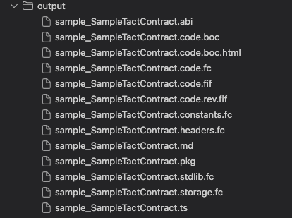  
output目录就是我们配置的编译结果文件输出目录  
此输出目录中有func文件、fif文件、pkg文件、ts文件等，一般Tact文件会被编译为FunC文件，FunC文件编译为fift文件。  
3. 部署合约  
执行部署，输入命令：yarn deploy，等待代码执行完成。  
contract.deploy.ts为部署合约的TypeScript代码，如下：
```
import * as fs from "fs";
import * as path from "path";
import { Address, contractAddress } from "@ton/core";
import { SampleTactContract } from "./output/sample_SampleTactContract";
import { prepareTactDeployment } from "@tact-lang/deployer";

(async () => {
    // Parameters
    let testnet = true;
    let packageName = "sample_SampleTactContract.pkg";
    let owner = Address.parse("kQBM7QssP28PhrctDOyd47_zpFfDiQvv5V9iXizNopb1d2LB");
    let init = await SampleTactContract.init(owner);

    // Load required data
    let address = contractAddress(0, init);
    let data = init.data.toBoc();
    let pkg = fs.readFileSync(path.resolve(__dirname, "output", packageName));

    // Prepareing
    console.log("Uploading package...");
    let prepare = await prepareTactDeployment({ pkg, data, testnet });

    // Deploying
    console.log("============================================================================================");
    console.log("Contract Address");
    console.log("============================================================================================");
    console.log();
    console.log(address.toString({ testOnly: testnet }));
    console.log();
    console.log("============================================================================================");
    console.log("Please, follow deployment link");
    console.log("============================================================================================");
    console.log();
    console.log(prepare);
    console.log();
    console.log("============================================================================================");
})();
```
说明：此代码做了如下步骤  
* 导入相关的TS库
* 准备合约参数
* 准备部署合约
* 计算合约地址  
注：*TON 上智能合约的地址源自合约的初始代码单元（其实现的已编译 TVM 字节码）和合约的初始数据单元（其初始持久状态）建造）。如果我们知道这两个值，我们甚至可以在部署合约之前计算出合约的地址。该计算是确定性的且不可变的。*
* 合约部署网址  
代码运行成功的话，合约已经被上传至TON区块链上，代码会把合约部署网址打印出来。  
我们把合约部署网址复制到浏览器打开，即可看到我们上传TON区块链的智能合约。如下所示：  
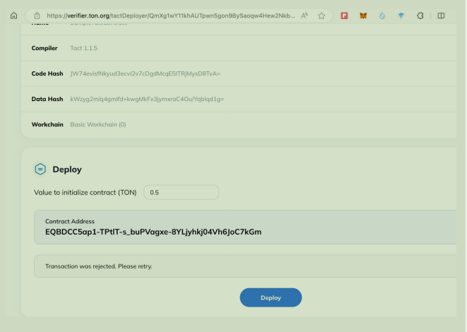  
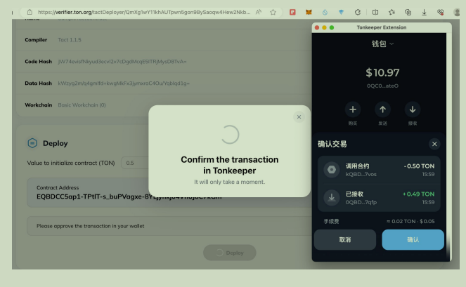  
点击deploy按钮会先连接钱包取得钱包授权，授权成功后合约就会被部署到区块链上。  
部署成功后的智能合约如下所示：  
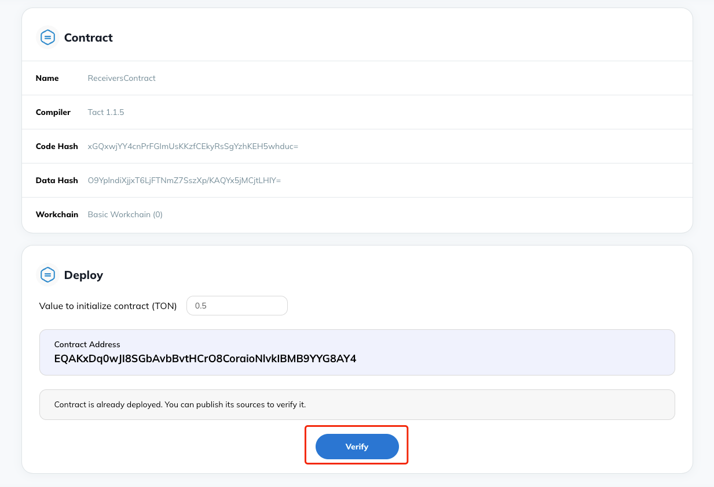  
点击verify按钮就能将此智能合约开源。  
复制合约地址，打开网址：https://testnet.tonviewer.com 输入合约地址就能查到此合约，如下所示：  
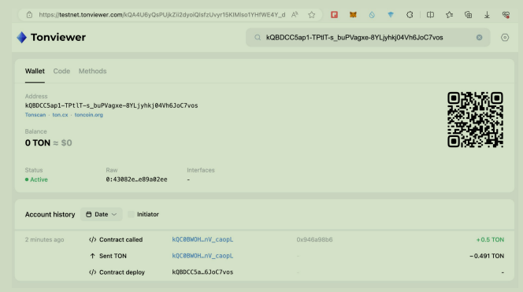  

4. 读取合约状态  
执行调用，输入命令：yarn read，等待代码执行完成，完成后会输出状态值。    
contract.read.ts为读取合约状态的TypeScript代码，如下：   
```
import * as fs from "fs";
import * as path from "path";
import { Address, contractAddress, TonClient4 } from "ton";
import { SampleTactContract } from "./output/sample_SampleTactContract";
import { prepareTactDeployment } from "@tact-lang/deployer";

(async () => {
    const client = new TonClient4({
        endpoint: "https://sandbox-v4.tonhubapi.com", // 🔴 Test-net API endpoint
    });

    // Parameters
    let testnet = true;
    let packageName = "sample_SampleTactContract.pkg";
    let owner = Address.parse("kQBM7QssP28PhrctDOyd47_zpFfDiQvv5V9iXizNopb1d2LB");
    let init = await SampleTactContract.init(owner);
    let contract_address = contractAddress(0, init);

    // Prepareing
    console.log("Reading Contract Info...");
    console.log(contract_address);

    // Input the contract address
    let contract = await SampleTactContract.fromAddress(contract_address);
    let contract_open = await client.open(contract);
    console.log("Counter Value: " + (await contract_open.getCounter()));
})();
```
说明：此代码做了如下步骤  
* 导入TON的开发库
* 准备合约参数
* 计算合约地址  
注：*此处计算合约地址的方法和上一步计算合约地址的方式一致*
* 调用getCounter读取状态值
5. 写入合约状态  
执行调用，输入命令：yarn write，等待代码执行完成，完成后会输出状态值。    
contract.write.ts为读取合约状态的TypeScript代码，如下：
```
import { Address, contractAddress, toNano } from "@ton/core";
import { TonClient4, WalletContractV4 } from "@ton/ton";
import { SampleTactContract } from "./output/sample_SampleTactContract";
import { mnemonicToPrivateKey } from "@ton/crypto";

const Sleep = (ms: number)=> {
    return new Promise(resolve=>setTimeout(resolve, ms))
}

(async () => {
    const client = new TonClient4({
        endpoint: "https://sandbox-v4.tonhubapi.com", // 🔴 Test-net API endpoint
    });

    // open wallet v4 (notice the correct wallet version here)
    const mnemonic = "excite tenant track brief card travel picture company suggest shed usage wire evolve advice lady inform key regular hockey pride health corn dish trigger"; // your 24 secret words (replace ... with the rest of the words)
    const key = await mnemonicToPrivateKey(mnemonic.split(" "));
    const wallet = WalletContractV4.create({ publicKey: key.publicKey, workchain: 0 });
    
    // open wallet and read the current seqno of the wallet
    const walletContract = client.open(wallet);
    const walletSender = walletContract.sender(key.secretKey);

    // open the contract address
    let owner = Address.parse("0QD8d5vx-7hiviuMMCU_xXHyg9PToCHgQB1MwcTkgG7dIbkt");
    let init = await SampleTactContract.init(owner);
    let contract_address = contractAddress(0, init);
    let contract = await SampleTactContract.fromAddress(contract_address);
    let contract_open = await client.open(contract);

    // send message to contract
    await contract_open.send(walletSender, { value: toNano(1) }, "increment");
    
    await Sleep(3000);
    console.log("Counter Value: " + (await contract_open.getCounter()));
})();
```
说明：此代码做了如下步骤  
* 导入TON的开发库
* 准备合约参数  
注：*这里我们使用钱包的恢复短语（助记词）获取钱包密钥*  
```
// open wallet v4 (notice the correct wallet version here)
const mnemonic = "excite tenant track brief card travel picture company suggest shed usage wire evolve advice lady inform key regular hockey pride health corn dish trigger"; // your 24 secret words (replace ... with the rest of the words)
const key = await mnemonicToPrivateKey(mnemonic.split(" "));
const wallet = WalletContractV4.create({ publicKey: key.publicKey, workchain: 0 });
```
* 计算合约地址  
  注：*此处计算合约地址的方法和上一步计算合约地址的方式一致*
* 发送increment消息写入状态值
## 5 总结
*   TON生态背靠Telegram
*   TON的合约语言有FunC和Tact
*   在TON上操作，需要钱包和TON代币，开发时建议使用TON测试网络
*   Tact开发环境搭建
*   Tact简单示例合约编写，编译、部署、和调用
## 6 参考资料
*   <https://docs.ton.org/>
*   <https://tact-lang.org/>
*   <https://github.com/tact-lang/awesome-tact>
*   <https://docs.tact-lang.org/>
*   <https://ton.app>
*   <https://foresightnews.pro/article/detail/21329>
*   <https://www.fx168news.com/article/392979>
*   <https://www.panewslab.com/zh/articledetails/ty2spsyy.html>
*   <https://www.techflowpost.com/article/detail_14664.html>
