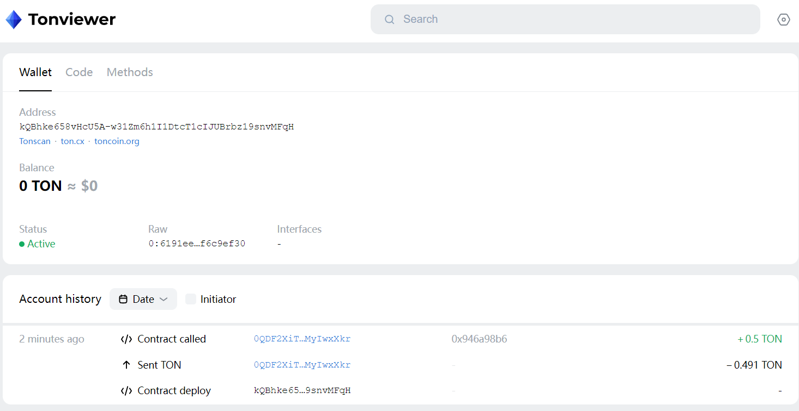

# OpenBuild TON Bootcamp任务一：新增getter方法和消息处理方法，并部署和调用

## 1 任务要求

   - 修改SampleTactContract合约,增加一个getter方法,重新部署,并调用此新方法
   - 修改SampleTactContract合约,增加一个消息处理方法,重新部署,并发送此新消息

## 2 合约开发

修改合约新增getter方法和消息处理方法：

```rust
import "@stdlib/deploy";

message Add {
    amount: Int as uint32;
}

message Minus {
    amount: Int as uint32;
}

contract SampleTactContract with Deployable {

    owner: Address;
    counter: Int as uint32;

    init(owner: Address) {
        self.owner = owner;
        self.counter = 0;
    }

    fun add(v: Int) {
        // Check sender
        let ctx: Context = context();
        require(ctx.sender == self.owner, "Invalid sender");
        
        // Update counter
        self.counter = (self.counter + v);
    }

    fun minus(v: Int) {
        // Check sender
        let ctx: Context = context();
        require(ctx.sender == self.owner, "Invalid sender");
        
        // Update counter
        self.counter = (self.counter - v);
    }

    receive(msg: Add) {
        self.add(msg.amount);
    }

    // 新增消息处理方法1
    receive(msg: Minus) {
        self.minus(msg.amount);
    }

    receive("increment") {
        self.add(1);
        self.reply("incremented".asComment());
    }

    // 新增消息处理方法2
    receive("decrement") {
        self.minus(1);
        self.reply("decremented".asComment());
    }

    get fun counter(): Int {
        return self.counter;
    }

    // 新增getter方法
    get fun getter(): Int {
        return self.counter;
    }
}
```

## 3 合约编译

```bash
$ yarn build
yarn run v1.22.19

$ tact --config ./tact.config.json
💼 Compiling project sample...
   > SampleTactContract: tact compiler
   > SampleTactContract: func compiler
   > SampleTactContract: fift decompiler
   > Packaging
   > SampleTactContract
   > Bindings
   > SampleTactContract
   > Reports
   > SampleTactContract
Done in 1.58s.
```

## 4 合约部署

```bash
$ yarn deploy
yarn run v1.22.19

$ ts-node ./sources/contract.deploy.ts
Uploading package...
============================================================================================
Contract Address
============================================================================================

kQBhke658vHcU5A-w31Zm6h1I1DtcT1cIJUBrbz19snvMFqH

============================================================================================
Please, follow deployment link
============================================================================================

https://verifier.ton.org/tactDeployer/QmXr3TEmpXv3z4gW4nUoGzk8SQHiqSTC1igYJCtMcfMTbX?testnet

============================================================================================
Done in 2.62s.
```


浏览器查看：

https://testnet.tonviewer.com/EQBhke658vHcU5A-w31Zm6h1I1DtcT1cIJUBrbz19snvMOEN



## 5 完善调用代码

```js
    console.log("current Counter Value: " + (await contract_open.getCounter()));

    // send message to contract
    await contract_open.send(walletSender, { value: toNano(1) }, "increment");
    await Sleep(20000);
    console.log("after increment Counter Value: " + (await contract_open.getCounter()));

    await contract_open.send(walletSender, { value: toNano(1) }, "decrement");
    await Sleep(20000);
    console.log("after decrement Counter Value: " + (await contract_open.getCounter()));

    const add: Add = {
        $$type: "Add",
        amount: BigInt(100),
    };
    await contract_open.send(walletSender, { value: toNano(1) }, add);
    await Sleep(20000);
    console.log("after add 100 Counter Value: " + (await contract_open.getCounter()));

    const minus: Minus = {
        $$type: "Minus",
        amount: BigInt(50),
    };
    await contract_open.send(walletSender, { value: toNano(1) }, minus);
    await Sleep(20000);
    console.log("after minus 50 Counter Value: " + (await contract_open.getGetter()));
```

## 6 合约调用执行

```bash
$ yarn write
yarn run v1.22.19
warning ../../../../package.json: No license field
$ ts-node ./sources/contract.write.ts
current Counter Value: 101
after increment Counter Value: 102
after decrement Counter Value: 101
after add 100 Counter Value: 201
after minus 50 Counter Value: 151
Done in 83.77s.
```

