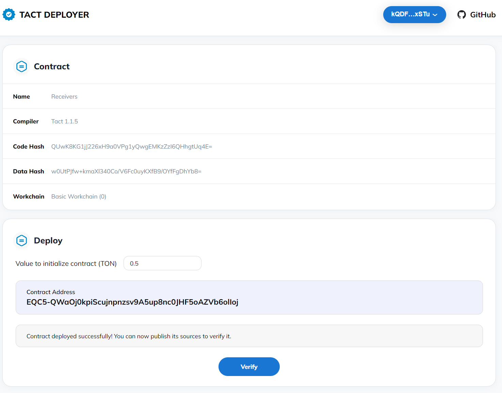
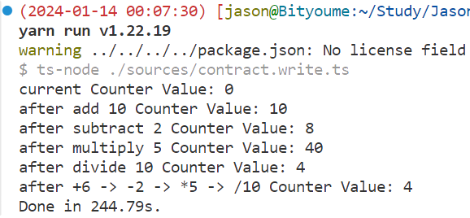
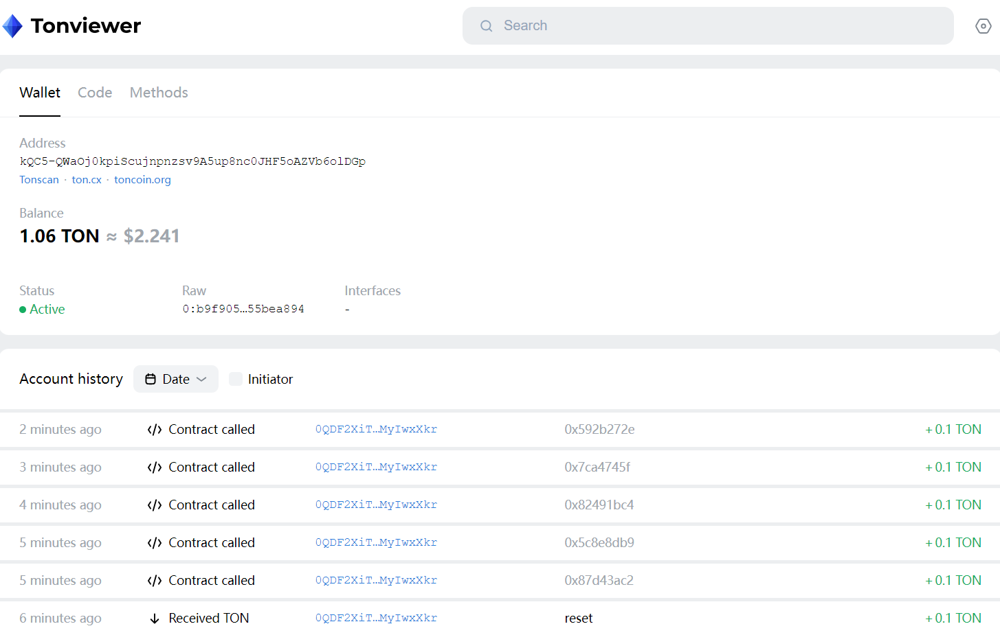

# OpenBuild TON Bootcamp任务2：增加Multiply&Divide消息处理及部署和调用

## 1 任务要求

- 增加 Multiply/Divide 消息，并实现对应的接收处理方法
- 通过上一课的ts工程，将合约部署到链上，并向合约随机发送加减乘除指令，在区块浏览器查看交易信息

## 2 合约开发

```rust
import "@stdlib/deploy";

// this message will cause our contract to add an amount to the counter
message Add {
    amount: Int as uint32;
}

// this message will cause our contract to subtract an amount from the counter
message Subtract {
    amount: Int as uint32;
}

message Multiply{
    amount: Int as uint32;
}

message Divide {
    amount: Int as uint32;
}

// this message will cause our contract to do a complex math operation on the counter
message MultiMath {
    add: Int as uint32;
    subtract: Int as uint32;
    multiply: Int as uint32;
    divide: Int as uint32;
}

contract Receivers with Deployable {

    val: Int as int64;
 
    init() {
        self.val = 0;
    }

    // handler for the "Add" message - this is a binary message that has an input argument (amount)
    receive(msg: Add) {
        self.val = self.val + msg.amount;
    }

    // handler for the "Subtract" message - this is a different binary message although its format is identical
    receive(msg: Subtract) {
        self.val = self.val - msg.amount;
    }

    receive(msg: Multiply) {
        self.val = self.val * msg.amount;
    }

    receive(msg: Divide) {
        require(msg.amount != 0, "Invalid divide amount");
        self.val = self.val / msg.amount;
    }

    // handler for the "MultiMath" message - this is a binary message that holds multiple input arguments
    receive(msg: MultiMath) {
        self.val = self.val + msg.add;
        self.val = self.val - msg.subtract;
        self.val = self.val * msg.multiply;

        if msg.divide != 0 {
            self.val = self.val / msg.divide;
        }
    }

    receive("reset") {
        self.val = 0;
    }

    // handler for "increment" textual message - this is a textual string message, these cannot carry input arguments
    receive("increment") {
        self.val = self.val + 1;
    }

    // handler for "decrement" textual message - this is a different textual string message, you can have as many as you want
    receive("decrement") {
        self.val = self.val - 1;
    }
 
    get fun value(): Int {
        return self.val;
    }
}
```

## 3 合约编译

```bash
$ yarn build
yarn run v1.22.19
$ tact --config ./tact.config.json
💼 Compiling project sample...
   > Receivers: tact compiler
   > Receivers: func compiler
   > Receivers: fift decompiler
   > Packaging
   > Receivers
   > Bindings
   > Receivers
   > Reports
   > Receivers
Done in 1.56s.

```

## 4 合约部署

```bash
$ yarn deploy
yarn run v1.22.19
$ ts-node ./sources/contract.deploy.ts
Uploading package...
============================================================================================
Contract Address
============================================================================================

kQC5-QWaOj0kpiScujnpnzsv9A5up8nc0JHF5oAZVb6olDGp

============================================================================================
Please, follow deployment link
============================================================================================

https://verifier.ton.org/tactDeployer/QmUVpRDpgwnxo5zPoYHcW6yk3UW2ArsoFbEU3Uhyp2AnRR?testnet

============================================================================================
Done in 2.95s.

```

https://verifier.ton.org/tactDeployer/QmUVpRDpgwnxo5zPoYHcW6yk3UW2ArsoFbEU3Uhyp2AnRR?testnet



浏览器查看：

https://testnet.tonviewer.com/kQC5-QWaOj0kpiScujnpnzsv9A5up8nc0JHF5oAZVb6olDGp


## 5 完善调用代码

```js
    await contract_open.send(walletSender, { value: toNano("0.1") }, "reset");
    await Sleep(40000);
    console.log("current Counter Value: " + (await contract_open.getValue()));

    const add: Add = {
        $$type: "Add",
        amount: 10n,
    };
    await contract_open.send(walletSender, { value: toNano("0.1") }, add);
    await Sleep(40000);
    console.log("after add 10 Counter Value: " + (await contract_open.getValue()));

    const subtract: Subtract = {
        $$type: "Subtract",
        amount: 2n,
    };
    await contract_open.send(walletSender, { value: toNano("0.1") }, subtract);
    await Sleep(40000);
    console.log("after subtract 2 Counter Value: " + (await contract_open.getValue()));

    const multiply: Multiply = {
        $$type: "Multiply",
        amount: 5n,
    };
    await contract_open.send(walletSender, { value: toNano("0.1") }, multiply);
    await Sleep(40000);
    console.log("after multiply 5 Counter Value: " + (await contract_open.getValue()));

    const divide: Divide = {
        $$type: "Divide",
        amount: 10n,
    };
    await contract_open.send(walletSender, { value: toNano("0.1") }, divide);
    await Sleep(40000);
    console.log("after divide 10 Counter Value: " + (await contract_open.getValue()));

    const multiMath: MultiMath = {
        $$type: "MultiMath",
        add: 6n,
        subtract: 2n,
        multiply: 5n,
        divide: 10n,
    };
    await contract_open.send(walletSender, { value: toNano("0.1") }, multiMath);
    await Sleep(40000);
    console.log("after +6 -> -2 -> *5 -> /10 Counter Value: " + (await contract_open.getValue()));
```

## 6 合约调用执行

```bash
$ yarn write
```



## 7 浏览器查看

https://testnet.tonviewer.com/kQC5-QWaOj0kpiScujnpnzsv9A5up8nc0JHF5oAZVb6olDGp

